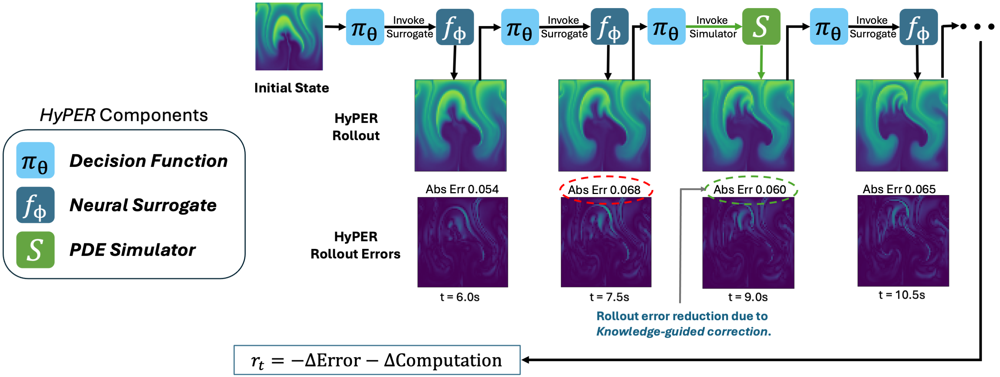

# HyPER: Hybrid PDE Prediction with Reinforcement Learning

Repository comprising the source code and links to datasets and pre-trained models for the ICLR 2025 paper [**Model-Agnostic Knowledge Guided Correction for Improved Neural Surrogate Rollout**](https://openreview.net/pdf?id=3ep9ZYMZS3).



> **The code included in this repository was developed for research purposes and is provided "as is". It has not been extensively tested, let us know if you run into issues.**

## Citation

If you use our code, models, or datasets please cite:

```bibtex
@inproceedings{srikishanmodel,
  title={Model-Agnostic Knowledge Guided Correction for Improved Neural Surrogate Rollout},
  author={Srikishan, Bharat and O'Malley, Daniel and Mehana, Mohamed and Lubbers, Nicholas and Muralidhar, Nikhil},
  booktitle={The Thirteenth International Conference on Learning Representations}
}
```

## Installation

1. Clone this repository: 
```sh
git clone https://github.com/scailab/HyPER.git
```
2. Install required packages and anaconda environment:
```sh
conda env create -n hyper --file environment.yml
```
3. Activate the environment:
```sh
conda activate hyper
```
4. Download the Navier-Stokes dataset [here](https://huggingface.co/datasets/scailab/hyper-navier-stokes-64-1000/resolve/main/ns_data_64_1000.h5) and place it in the `HyPER/data/` directory.
5. If you want to use our pre-trained models for evaluation, download their checkpoints [here](https://huggingface.co/scailab/hyper-models/tree/main) (download each *.pt file) and place them in the `HyPER/model_checkpoints/` directory.

## Evaluation and Results

1. Once you have all trained model checkpoints in the `HyPER/model_checkpoints/` directory, navigate to the src directory:
```sh
cd HyPER/src
```
2. Evaluate all models using:
```sh
python test_all_models_ns.py --output-dir ../eval-results
```
3. Start jupyter lab in the `HyPER` directory:
```sh
cd ../
jupyter lab
```
4. Open and run the notebook `HyPER/notebooks/Evaluation_Results.ipynb` to see evaluation results.

## Training

If you wish to train your own surrogates or HyPER RL model, follow the steps below.

### UNet Surrogate Training

1. Train UNet surrogate on 400 trajectory Navier-Stokes dataset:
```sh
python train_one_step_ns_unet.py --no-use-large-dataset --output-dir ../model_checkpoints/unet_400
```
2. Train UNet surrogate on 800 trajectory Navier-Stokes dataset:
```sh
python train_one_step_ns_unet.py --use-large-dataset --output-dir ../model_checkpoints/unet_800
```

#### Parameters for UNet training code:

```
python train_one_step_ns_unet.py -h
usage: train_one_step_ns_unet.py [-h] [OPTIONS]

Code to train/finetune UNet on Navier-Stokes dataset

╭─ options ──────────────────────────────────────────────────────────────────────────────────────────────────────────────╮
│ -h, --help              show this help message and exit                                                                │
│ --output-dir STR        Output directory which will get created if it doesn't exist. (required)                        │
│ --dataset-path PATH     Path to dataset. (default: ../data/ns_data_64_1000.h5)                                         │
│ --dataset-split FLOAT FLOAT FLOAT FLOAT                                                                                │
│                         Dataset split percentages for train, rl, validation, and test sets. (default: 0.4 0.4 0.1 0.1) │
│ --random-seed INT       Random seed. (default: 42)                                                                     │
│ --device STR            Device to run on. (default: cuda)                                                              │
│ --batch-size INT        Batch size. (default: 8)                                                                       │
│ --ST INT                Start timestep. (default: 8)                                                                   │
│ --FT INT                End timestep. (default: 28)                                                                    │
│ --lr FLOAT              Learning rate for Adam optimizer (default: 0.0001)                                             │
│ --epochs INT            Number of epochs to train (default: 200)                                                       │
│ --use-large-dataset, --no-use-large-dataset                                                                            │
│                         Use training and RL datasets for training (800 trajectories instead of 400) (default: False)   │
│ --finetune-model-path {None}|PATH                                                                                      │
│                         Finetune existing model (default: None)                                                        │
│ --job-name STR          Job name (default: train-unet-lr-0.0001-ds-ns-64x64-bs-8-epochs-200-1)                         │
╰────────────────────────────────────────────────────────────────────────────────────────────────────────────────────────╯
```

### FNO Surrogate Training

1. Train FNO surrogate on 400 trajectory Navier-Stokes dataset:
```sh
python train_one_step_ns_fno.py --no-use-large-dataset --output-dir ../model_checkpoints/fno_800
```
2. Train FNO surrogate on 800 trajectory Navier-Stokes dataset:
```sh
python train_one_step_ns_fno.py --use-large-dataset --output-dir ../model_checkpoints/fno_400
```

#### Parameters for FNO training code:

```
python train_one_step_ns_fno.py -h
usage: train_one_step_ns_fno.py [-h] [OPTIONS]

Code to train/finetune fno on Navier-Stokes dataset

╭─ options ──────────────────────────────────────────────────────────────────────────────────────────────────────────────╮
│ -h, --help              show this help message and exit                                                                │
│ --output-dir STR        Output directory which will get created if it doesn't exist. (required)                        │
│ --dataset-path PATH     Path to dataset. (default: ../data/ns_data_64_1000.h5)                                         │
│ --dataset-split FLOAT FLOAT FLOAT FLOAT                                                                                │
│                         Dataset split percentages for train, rl, validation, and test sets. (default: 0.4 0.4 0.1 0.1) │
│ --random-seed INT       Random seed. (default: 42)                                                                     │
│ --device STR            Device to run on. (default: cuda)                                                              │
│ --batch-size INT        Batch size. (default: 8)                                                                       │
│ --ST INT                Start timestep. (default: 8)                                                                   │
│ --FT INT                End timestep. (default: 28)                                                                    │
│ --lr FLOAT              Learning rate for Adam optimizer (default: 1e-05)                                              │
│ --epochs INT            Number of epochs to train (default: 200)                                                       │
│ --use-large-dataset, --no-use-large-dataset                                                                            │
│                         Use training and RL datasets for training (800 trajectories instead of 400). (default: True)   │
│ --finetune-model-path {None}|PATH                                                                                      │
│                         Finetune existing model. (default: None)                                                       │
│ --job-name STR          Job name. (default: train-fno-lr-1e-05-ds-ns-64x64-bs-8-epochs-200-1)                          │
╰────────────────────────────────────────────────────────────────────────────────────────────────────────────────────────╯
```

### UNet-Multistep Surrogate Training

Train multistep UNet on 800 trajectory Navier-Stokes dataset:

```sh
python train_multistep_ns_unet.py --use-large-dataset --output-dir ../model_checkpoints/unet-multistep
```

#### Parameters for UNet-Multistep training code:

```
python train_multistep_ns_unet.py -h
usage: train_multistep_ns_unet.py [-h] [OPTIONS]

Code to train multistep UNet on Navier-Stokes dataset

╭─ options ──────────────────────────────────────────────────────────────────────────────────────────────────────────────╮
│ -h, --help              show this help message and exit                                                                │
│ --output-dir STR        Output directory which will get created if it doesn't exist. (required)                        │
│ --dataset-path PATH     Path to dataset. (default: ../data/ns_data_64_1000.h5)                                         │
│ --dataset-split FLOAT FLOAT FLOAT FLOAT                                                                                │
│                         Dataset split percentages for train, rl, validation, and test sets. (default: 0.4 0.4 0.1 0.1) │
│ --random-seed INT       Random seed. (default: 42)                                                                     │
│ --device {cuda,cpu}     Device to run on. (default: cuda)                                                              │
│ --batch-size INT        Batch size. (default: 8)                                                                       │
│ --ST INT                Start timestep. (default: 8)                                                                   │
│ --FT INT                End timestep. (default: 28)                                                                    │
│ --lr FLOAT              Learning rate for Adam optimizer (default: 0.0001)                                             │
│ --epochs INT            Number of epochs to train (default: 200)                                                       │
│ --use-large-dataset, --no-use-large-dataset                                                                            │
│                         Use training and RL datasets for training (800 trajectories instead of 400) (default: True)    │
│ --finetune-model-path {None}|PATH                                                                                      │
│                         Finetune existing model (default: None)                                                        │
│ --job-name STR          Job name (default: train-multistep-20-unet-800-lr-0.0001-ns-64x64-bs-8-epochs-200-2)           │
╰────────────────────────────────────────────────────────────────────────────────────────────────────────────────────────╯
```

### Multiple Physics Pretraining (MPP) Surrogate Training

Train MPP on 800 trajectory Navier-Stokes dataset:

```sh
python train_multistep_ns_mpp.py --use-large-dataset --output-dir ../model_checkpoints/mpp
```

#### Parameters for MPP training code:

```
python train_one_step_ns_mpp.py -h
usage: train_one_step_ns_mpp.py [-h] [OPTIONS]

Code to finetune MPP on Navier-Stokes dataset

╭─ options ──────────────────────────────────────────────────────────────────────────────────────────────────────────────╮
│ -h, --help              show this help message and exit                                                                │
│ --output-dir STR        Output directory which will get created if it doesn't exist. (required)                        │
│ --dataset-path PATH     Path to dataset. (default: ../data/ns_data_64_1000.h5)                                         │
│ --dataset-split FLOAT FLOAT FLOAT FLOAT                                                                                │
│                         Dataset split percentages for train, rl, validation, and test sets. (default: 0.4 0.4 0.1 0.1) │
│ --random-seed INT       Random seed. (default: 42)                                                                     │
│ --device STR            Device to run on. (default: cuda)                                                              │
│ --batch-size INT        Batch size. (default: 8)                                                                       │
│ --ST INT                Start timestep. (default: 8)                                                                   │
│ --FT INT                End timestep. (default: 28)                                                                    │
│ --lr FLOAT              Learning rate for Adam optimizer (default: 0.0001)                                             │
│ --mpp-config PATH       Path to MPP model yaml config file. (default: conf/mpp_avit_s_config.yaml)                     │
│ --checkpoint-path PATH  Path to trained surrogate model checkpoint. (default: ../model_checkpoints/MPP_AViT_S)         │
│ --epochs INT            Number of epochs to train (default: 200)                                                       │
│ --use-large-dataset, --no-use-large-dataset                                                                            │
│                         Use training and RL datasets for training (800 trajectories instead of 400). (default: True)   │
│ --finetune-model, --no-finetune-model                                                                                  │
│                         Finetune existing model (default: False)                                                       │
│ --job-name STR          Job name (default: train-mpp-s-800-lr-0.0001-ns-64x64-bs-8-epochs-200-1)                       │
╰────────────────────────────────────────────────────────────────────────────────────────────────────────────────────────╯
```

### PDE-Refiner Surrogate Training

Train PDE-Refiner on 800 trajectory Navier-Stokes dataset:

```sh
python train_multistep_ns_refiner.py --use-large-dataset --output-dir ../model_checkpoints/refiner
```

#### Parameters for PDE-Refiner training code:

```
python train_one_step_ns_refiner.py -h
usage: train_one_step_ns_refiner.py [-h] [OPTIONS]

Code to train PDE-Refiner on Navier-Stokes dataset

╭─ options ──────────────────────────────────────────────────────────────────────────────────────────────────────────────╮
│ -h, --help              show this help message and exit                                                                │
│ --output-dir STR        Output directory which will get created if it doesn't exist. (required)                        │
│ --dataset-path PATH     Path to dataset. (default: ../data/ns_data_64_1000.h5)                                         │
│ --dataset-split FLOAT FLOAT FLOAT FLOAT                                                                                │
│                         Dataset split percentages for train, rl, validation, and test sets. (default: 0.4 0.4 0.1 0.1) │
│ --random-seed INT       Random seed. (default: 42)                                                                     │
│ --device {cuda,cpu}     Device to run on. (default: cuda)                                                              │
│ --batch-size INT        Batch size. (default: 8)                                                                       │
│ --ST INT                Start timestep. (default: 8)                                                                   │
│ --FT INT                End timestep. (default: 28)                                                                    │
│ --lr FLOAT              Learning rate for Adam optimizer (default: 0.0001)                                             │
│ --epochs INT            Number of epochs to train (default: 200)                                                       │
│ --finetune-model-path {None}|PATH                                                                                      │
│                         Finetune existing model path (default: None)                                                   │
│ --use-large-dataset, --no-use-large-dataset                                                                            │
│                         Use training and RL datasets for training (800 trajectories instead of 400). (default: True)   │
│ --job-name STR          Job name (default: train-refiner-unet-lr-0.0001-ns-64x64-bs-8-epochs-200-1)                    │
╰────────────────────────────────────────────────────────────────────────────────────────────────────────────────────────╯
```

### HyPER RL Training

Train the HyPER RL model, making sure to specify your UNet surrogate model checkpoint path:
```sh
python train_rl_reinforce_ns.py --checkpoint-path {UNET SURROGATE MODEL CHECKPOINT PATH} --output-dir ../model_checkpoints/rl
```

#### Parameters for HyPER RL training code:

```
python train_rl_reinforce_ns.py -h
usage: train_rl_reinforce_ns.py [-h] [OPTIONS]

Code to test trained UNet on Navier-Stokes dataset

╭─ options ──────────────────────────────────────────────────────────────────────────────────────────────────────────────────────────────────────────────────────────────╮
│ -h, --help              show this help message and exit                                                                                                                │
│ --output-dir STR        Output directory which will get created if it doesn't exist. (required)                                                                        │
│ --dataset-path PATH     Path to dataset. (default: ../data/ns_data_64_1000.h5)                                                                                         │
│ --dataset-split FLOAT FLOAT FLOAT FLOAT                                                                                                                                │
│                         Dataset split percentages for train, test, validation, and test sets. (default: 0.4 0.4 0.1 0.1)                                               │
│ --random-seed INT       Random seed. (default: 42)                                                                                                                     │
│ --device STR            Device to run on. (default: cuda)                                                                                                              │
│ --batch-size INT        Batch size. (default: 1)                                                                                                                       │
│ --ST INT                Start timestep. (default: 8)                                                                                                                   │
│ --FT INT                End timestep. (default: 28)                                                                                                                    │
│ --dt FLOAT              Timestep duration in seconds (default: 1.5)                                                                                                    │
│ --buoyancy-factor FLOAT                                                                                                                                                │
│                         Buoyancy factor for sim (default: 0.5)                                                                                                         │
│ --diffusion-coef FLOAT  Diffusion coefficient for sim (default: 0.01)                                                                                                  │
│ --checkpoint-path PATH  Path to trained surrogate model checkpoint. (default: ../model_checkpoints/unet-400-lr-0.0001-bs-8-epochs-200-1_model_checkpoint_199_final.pt) │
│ --learning-rate FLOAT   Learning rate (default: 1e-05)                                                                                                                 │
│ --epochs INT            Number of epochs to train for (default: 30)                                                                                                    │
│ --lam FLOAT             Lambda cost parameter, what percentage to use the simulator for each trajectory (default: 0.3)                                                 │
│ --S INT                 Number of timesteps for which the rl should select actions for with each call (default: 4)                                                     │
│ --job-name STR          Job name (default: train-rl-resnet-18-unet-400-lam-0.3-multistep-4-reinforce-simple-baseline-ns-64-lr-1e-05-ts-20-train-1)                     │
╰────────────────────────────────────────────────────────────────────────────────────────────────────────────────────────────────────────────────────────────────────────╯
```


